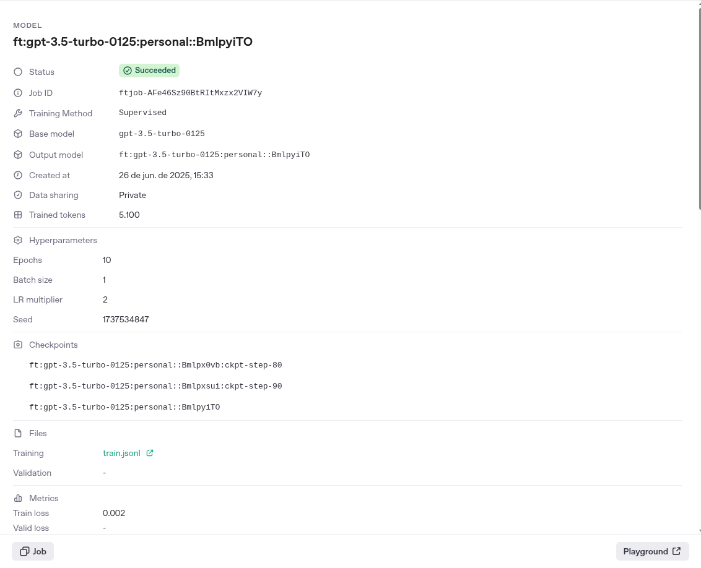
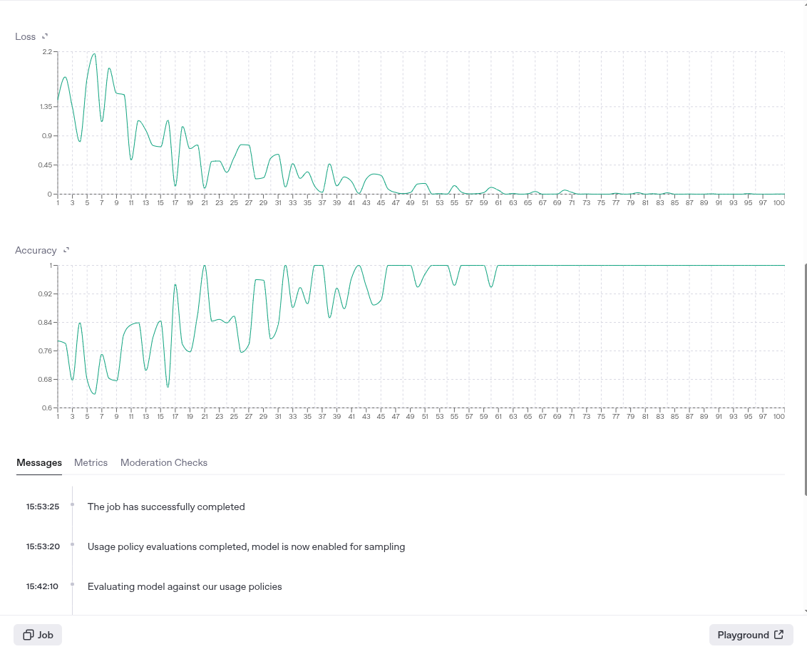

# Python Fine-Tuning OpenAI

Um projeto Python para realizar fine-tuning de modelos da OpenAI utilizando dados personalizados.

## Descrição

Este projeto oferece uma solução completa para treinar modelos customizados utilizando a API da OpenAI. Ele permite fazer upload de dados de treinamento, criar jobs de fine-tuning, monitorar o progresso do treinamento e realizar inferências com o modelo treinado.


## O que NÃO é este projeto ##
Este projeto não utiliza RAG (Retrieval-Augmented Generation), que é uma abordagem em que o modelo busca informações em bases externas para gerar respostas atualizadas. Diferentemente do RAG, aqui o modelo é diretamente ajustado com novos dados, o que significa que o conhecimento incorporado vem do processo de treinamento e está "embutido" no modelo final.

## Funcionalidades

- **Upload de arquivos de treinamento** para a API da OpenAI
- **Criação e gerenciamento de jobs de fine-tuning**
- **Monitoramento em tempo real** do progresso do treinamento
- **Inferência com modelos customizados** treinados
- **Estrutura modular** com separação de responsabilidades


## Dashboard da OpenAi

Visualização do modelo fine-tuned no dashboard da OpenAI após o término do treinamento.

<p align="center">
  
</p>

<p align="center">
  
</p>


## Instalação

### Pré-requisitos

- Python >= 3.11
- Poetry (opcional, mas recomendado)

### Configuração do ambiente

1. Clone o repositório:
```bash
git clone <url-do-repositorio>
cd python-fine-tuning-openai
```

2. Instale as dependências:
```bash
# Com Poetry
poetry install

# Ou com pip
pip install requests python-dotenv
```

3. Configure as variáveis de ambiente:
```bash
cp .env.example .env
```

Edite o arquivo `.env` com suas credenciais:
```env
OPENAI_API_KEY=sua_chave_api_aqui
OPENAI_API_MODEL=gpt-3.5-turbo
```

## Uso

### Estrutura do projeto

```
python-fine-tuning-openai/
├── core/                   # Módulos principais
│   ├── upload.py          # Upload de arquivos
│   ├── tuning.py          # Gerenciamento de fine-tuning
│   └── inference.py       # Inferência com modelos
├── training_data/         # Dados de treinamento
├── config/               # Configurações
├── main.py               # Script principal
├── fine_tune_openai.py   # Script alternativo completo
└── .env                  # Variáveis de ambiente
```

### Executando o projeto

#### Opção 1: Usando o script principal
```bash
python main.py
```

#### Opção 2: Usando o script completo
```bash
python fine_tune_openai.py
```

### Preparação dos dados de treinamento

Crie um arquivo `train.jsonl` no diretório `training_data/` com o formato o arquivo deve conter no minimo 10 perguntas com respostas pra ser processado pelo openai:
```jsonl
{"messages": [{"role": "user", "content": "Pergunta exemplo"}, {"role": "assistant", "content": "Resposta exemplo"}]}
{"messages": [{"role": "user", "content": "Outra pergunta"}, {"role": "assistant", "content": "Outra resposta"}]}
```

## Desenvolvimento

### Estrutura modular

O projeto está organizado em módulos específicos:

- **`core/upload.py`**: Responsável pelo upload de arquivos para a API
- **`core/tuning.py`**: Gerencia a criação e monitoramento de jobs de fine-tuning
- **`core/inference.py`**: Realiza inferências com os modelos treinados

### Dependências principais

- `requests`: Para fazer chamadas HTTP à API da OpenAI
- `python-dotenv`: Para gerenciamento de variáveis de ambiente

## Exemplo de uso

```python
from core.upload import upload_file
from core.tuning import create_fine_tune_job, wait_for_completion
from core.inference import ask_model

# Upload do arquivo de treinamento
file_id = upload_file("training_data/train.jsonl")

# Criação do job de fine-tuning
job_id = create_fine_tune_job(file_id)

# Aguarda conclusão do treinamento
model_name = wait_for_completion(job_id)

# Realiza inferência com o modelo treinado
resposta = ask_model(model_name, "Sua pergunta aqui")
print("Resposta:", resposta)
```

## Nota importante

Certifique-se de ter créditos suficientes em sua conta da OpenAI, pois o fine-tuning consome tokens e pode gerar custos. Consulte a documentação oficial da OpenAI para informações sobre preços.